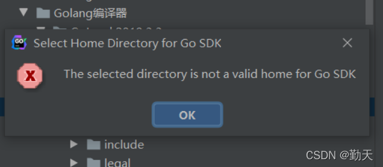

<!-- toc -->

- [1.gorm报注册db失败](#1gorm%E6%8A%A5%E6%B3%A8%E5%86%8Cdb%E5%A4%B1%E8%B4%A5)
  * [背景](#%E8%83%8C%E6%99%AF)
  * [报错](#%E6%8A%A5%E9%94%99)
  * [排查问题](#%E6%8E%92%E6%9F%A5%E9%97%AE%E9%A2%98)
  * [代码优化](#%E4%BB%A3%E7%A0%81%E4%BC%98%E5%8C%96)
  * [总结](#%E6%80%BB%E7%BB%93)
- [2.goland不能识别go的内置类型](#2goland%E4%B8%8D%E8%83%BD%E8%AF%86%E5%88%ABgo%E7%9A%84%E5%86%85%E7%BD%AE%E7%B1%BB%E5%9E%8B)
  * [问题](#%E9%97%AE%E9%A2%98)
  * [解决](#%E8%A7%A3%E5%86%B3)
- [3.同一台电脑存在2个golang版本，且都是通过brew安装的](#3%E5%90%8C%E4%B8%80%E5%8F%B0%E7%94%B5%E8%84%91%E5%AD%98%E5%9C%A82%E4%B8%AAgolang%E7%89%88%E6%9C%AC%E4%B8%94%E9%83%BD%E6%98%AF%E9%80%9A%E8%BF%87brew%E5%AE%89%E8%A3%85%E7%9A%84)
  * [如何指定使用的golang版本](#%E5%A6%82%E4%BD%95%E6%8C%87%E5%AE%9A%E4%BD%BF%E7%94%A8%E7%9A%84golang%E7%89%88%E6%9C%AC)

<!-- tocstop -->

## 1.gorm报注册db失败
### 背景
我的服务需要调用的db实例、库、表都是动态的，是从业务服务查询出配置，且这个配置可以随时增加、修改。因此db配置无法预先作为系统配置配好。
因此db没有办法在init()中预先注册，而在请求中注册可能会有重复注册的问题：
由于知道fgorm不支持拿着相同的configkey重复注册，如果拿相同的key注册时会报这个错误。因此采用了自己实现map+锁的方式记录已注册的db：
```
type DBManager struct {
    mu sync.Mutex
    registeredMap map[string]struct{}
}

func NewDBManager *DBManager {
    return &DBManager{
        registeredMap: make(map[string]struct{}),
    }
}

var (
    // 
    DBManagerIns *DBManager
    // 单例模式
    once sync.once
)

func GetDBManager() *DBManager {
    // 单例模式
	once.Do(func() {
		DBManagerIns = NewDBManager()
	})
	return DBManagerIns
}

func (m *DBManager) Register(...) error {
    m.mu.Lock()
    defer m.mu.Unlock()

    // 如果已经存在，不需要重新注册
	if _, exists := m.dbMap[configKey]; exists {
		return nil
	}

    err := gorm.RegisterDB(ctx, configKey, *config)
	if err != nil {
        ...
    }

    m.dbMap[configKey] = struct{}{}
    return nil
}

```

### 报错
报错原因提示：
```
"failed to register db since already exist: %s"
```
看起来这样实现依然走到了gorm.RegisterDB且报上面那个错误。这里确认所有地方都是通过GetDBManager取得DBManager的单例，因此锁+map是单例，且是生效的。

### 排查问题
正常来说，同一个configkey第二次开始的注册，都会走到map中是否存在configKey的逻辑，然后就返回了，不会走到下面这步。
在判断map中是否存在configKey的前后、及注册后都加上日志：
```
func (m *DBManager) Register(...) error {
    m.mu.Lock()
    defer m.mu.Unlock()
    
    log.Debug(..., log.String("configKey", configKey))
    // 如果已经存在，不需要重新注册
	if _, exists := m.dbMap[configKey]; exists {
		return nil
	}

    log.Debug(..., "not exist.", log.String("configKey", configKey))

    err := gorm.RegisterDB(ctx, configKey, *config)
	if err != nil {
        ...
        log.Error(..., "gorm.RegisterDB err.", log.ErrorField(err))
        return err
    }

    log.Debug(..., "Register ok.", log.String("configKey", configKey))
    m.dbMap[configKey] = struct{}{}
    return nil
}

```
再次测试，发现日志中没有"Register ok."的内容，也就是没有一次注册成功的。因此m.dbMap为空，肯定每次都会调用到gorm.RegisterDB。
那明明每次都没有注册成功，为什么多次注册都会报"重复注册"的错误呢？

这里只能先不要相信gorm包的报错信息，去看一下代码。发现了问题：他的逻辑是：
```
func RegisterDB(ctx context.Context, configKey string, ...) err {
    // 1.注册，如果是已注册过的，报错
    if _, loaded := (一个sync.Map).LoadOrStore(configKey, ...); loaded {
		return errors.Errorf("failed to register db since already exist: %s", configKey)
	}

    // 2.去ping一下是否通
    if err := ping(ctx, configKey, ...); err != nil {
        return err
    }
}

```
也就是说第一次调用的时候其实内部注册是成功的，只是ping那步报错才返回错误。而返回错误又导致我的代码走不到更新map的那一步。因此我这里不会记录该key已注册，后面又来重复注册，走到gorm.Register的注册逻辑就报错了。
这个时候问题其实已经清楚了，就再排查为什么ping不通就可以了。发现是密码错误，修改后就解决了。

### 代码优化
既然gorm.RegisterDB有2步，而且其实第一步就注册成功了，这里就应该细化错误打印和判断。是重复注册的错误，也应该更新map：
```
err := gorm.RegisterDB(ctx, configKey, *config)
	if err != nil {
		log.Error(ctx, "gorm.RegisterDB err.", log.String("configKey", configKey), log.ErrorField(err))
		// 如果不是重复注册的错误，直接报错
		if !isDuplicateRegisterError(err) {
			return err
		}
		log.Info(ctx, "the grom err is ErrRegistered.")
	}
```
这样第二次重复注册时，就能更新map了。好处是后面真正去执行的时候，就可以看到真实的错误，而不是一直是重复注册的错误，防止误判。

### 总结
1.遇到疑难问题，多打日志，在每个函数调用点打印日志，确认问题。
2.疑难问题的时候：不要被函数名迷惑，可能注册函数里不止做注册的事情，甚至可能他不是原子的，这里就不是原子的。所以不能认为注册报错，就没有注册。


## 2.goland不能识别go的内置类型
### 问题
在终端使用go命令没有问题，但是goland中不能识别内置类型。

### 解决
原因是goland->settings中GOROOT没有设置。
这里设置有一个限制，就是选择的目标目录要被goland识别为含有go的sdk，否则会报错"会报错The selected directory is not a valid home for Go SDK"。

就是这个问题用了比较多的时间。
最开始问AI，但是AI没有给出正确的原因，最后google查到，需在$GOROOT/src/runtime/internal/sys/zversion.go中增加
```
const TheVersion = `go1.21.13`
```
才能被goland识别。

## 3.同一台电脑存在2个golang版本，且都是通过brew安装的
### 如何指定使用的golang版本
(1) 修改系统环境变量，在PATH上加上想指定的go版本的安装目录；设置GOROOT环境变量为指定go版本的安装目录
(2) 修改brew的link关系：
```
brew info go # 查看当前link的版本

brew unlink go   # 取消当前链接版本

brew link --force --overwrite go@1.21  # link指定版本

go version # 验证
```

注意，整个过程中不要手动去删除安装的go/手动改动brew的链接关系，要通过brew，否则brew的管理会出现问题

(3) 修改goland中修改配置，选择指定版本go的安装目录为sdk目录(注意不能识别sdk时要在zversion中增加一行代码)
