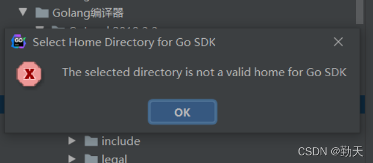

## 1.goland不能识别go的内置类型
### 问题
在终端使用go命令没有问题，但是goland中不能识别内置类型。

### 解决
原因是goland->settings中GOROOT没有设置。
这里设置有一个限制，就是选择的目标目录要被goland识别为含有go的sdk，否则会报错"会报错The selected directory is not a valid home for Go SDK"。

就是这个问题用了比较多的时间。
最开始问AI，但是AI没有给出正确的原因，最后google查到，需在$GOROOT/src/runtime/internal/sys/zversion.go中增加
```
const TheVersion = `go1.19.13`
```
才能被goland识别。

## 2.同一台电脑存在2个golang版本，且都是通过brew安装的
### 如何指定使用的golang版本
1. 修改系统环境变量，在PATH上加上想指定的go版本的安装目录；设置GOROOT环境变量为指定go版本的安装目录
2. 修改brew的link关系：
```
brew info go # 查看当前link的版本

brew unlink go   # 取消当前链接版本

brew link --force --overwrite go@1.19  # link指定版本

go version # 验证
```

注意，整个过程中不要手动去删除安装的go/手动改动brew的链接关系，要通过brew，否则brew的管理会出现问题

3. goland中修改配置，选择指定版本go的安装目录为sdk目录
