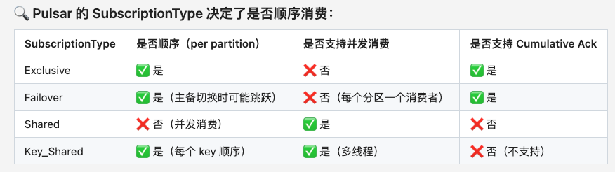

# 消息确认
## 单条确认

## 批量确认

## 累积确认
只在SubscriptionType（订阅类型）为 Exclusive或Failover模式有效。因为只有这两个订阅模式是全局顺序消费。

# 订阅类型
Exclusive独占、Failover、Shared、Key_Shared。

## 不同订阅类型的消费特性

## Key_Shared和Shared的区别

# 顺序消费实现机制
Pulsar虽没有显式offset，但它有内部的messageId顺序+ledger cursor机制来追踪消费进度，实现类似Kafka offset的功能，甚至更灵活。
顺序消费语义（Exclusive / Failover 模式）：消息必须「成功 ack」上一条消息后，才会被投递下一条消息。即前一条消息没处理成功，下一条不会被投递。

## Message ID
每条消息都有一个唯一的messageId（包含 ledgerId + entryId）。
messageId 是全局有序。

## Cursor
订阅在Broker端的消费进度指针。
每个订阅（subscription）在Broker上有一个Cursor。
Cursor。记录的是：
(1)已 ack 的消息（individual ack: bitmap；cumulative ack: messageId）。
(2)未 ack 的消息（用于 redelivery）。
Cursor是基于messageId 移动的。

# reconsume和nack的区别