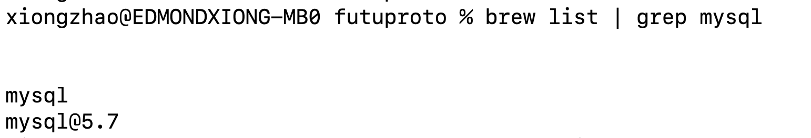

## 1.安装问题
安装后启动后，
执行：
```
mysql -u root
```
遇到：
```
ERROR 2002 (HY000): Can't connect to local MySQL server through socket '/tmp/mysql.sock' (2)
```

这里有2个问题：
### 有2个版本的mysql同时存在



#### 解决
卸载：
```
brew uninstall mysql@5.7
```
### 服务启动失败
```
mysql.server start      

Starting MySQL
. ERROR! The server quit without updating PID file (/usr/local/var/mysql/edmondxiong-mysql.pid).
```

#### 查问题
(1)检查权限：
```
sudo chown -R $(whoami) /usr/local/var/mysql
sudo chown $(whoami) /usr/local/etc/my.cnf
```

(2)删除旧的pid文件
```
rm /usr/local/var/mysql/*.pid
```

(3)查看mysql错误日志：
```
tail -f /usr/local/var/mysql/$(hostname).err

```
通过日志得到问题：
MySQL 服务器尝试从版本 8.0.23 升级到 9.0.1，这是一个不支持的升级路径。MySQL 服务器要求从最后一个 LTS 版本（长期支持版本）升级，而 8.0.23 不是 LTS 版本。

#### 解决
降级到 MySQL 8.0.x：
(1)卸载现有版本：
```
brew uninstall mysql

rm -rf /usr/local/var/mysql
rm -rf /usr/local/etc/my.cnf

```

(2)安装指定版本并启动：
```
brew install mysql@8.0

brew services start mysql@8.0

mysql.server start
```

(3)如果找不到mysql命令，记得按提示修改环境变量：
```
MySQL is configured to only allow connections from localhost by default

To connect run:
    mysql -u root

mysql@8.0 is keg-only, which means it was not symlinked into /usr/local,
because this is an alternate version of another formula.

If you need to have mysql@8.0 first in your PATH, run:
  echo 'export PATH="/usr/local/opt/mysql@8.0/bin:$PATH"' >> ~/.zshrc

For compilers to find mysql@8.0 you may need to set:
  export LDFLAGS="-L/usr/local/opt/mysql@8.0/lib"
  export CPPFLAGS="-I/usr/local/opt/mysql@8.0/include"

For pkg-config to find mysql@8.0 you may need to set:
  export PKG_CONFIG_PATH="/usr/local/opt/mysql@8.0/lib/pkgconfig"

To start mysql@8.0 now and restart at login:
  brew services start mysql@8.0
Or, if you don't want/need a background service you can just run:
  /usr/local/opt/mysql@8.0/bin/mysqld_safe --datadir\=/usr/local/var/mysql
```


## 2.