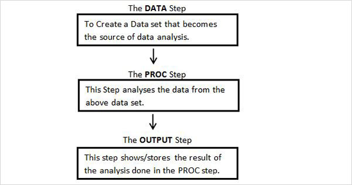

## sas程序结构


## 数据步(step)
### 用法
```
data output_dataset;
    set input_dataset;
    /* 数据处理代码 */
run;
```
以 data 语句开始一个数据步，并指定输出数据集的名称。
使用 set 语句指定输入数据集。
以 run; 结束数据步，告诉 SAS 执行这个数据步中的所有代码。

在数据步中的数据处理代码，会对数据集中的每个观察(行)进行处理，不需要自己写循环语句。