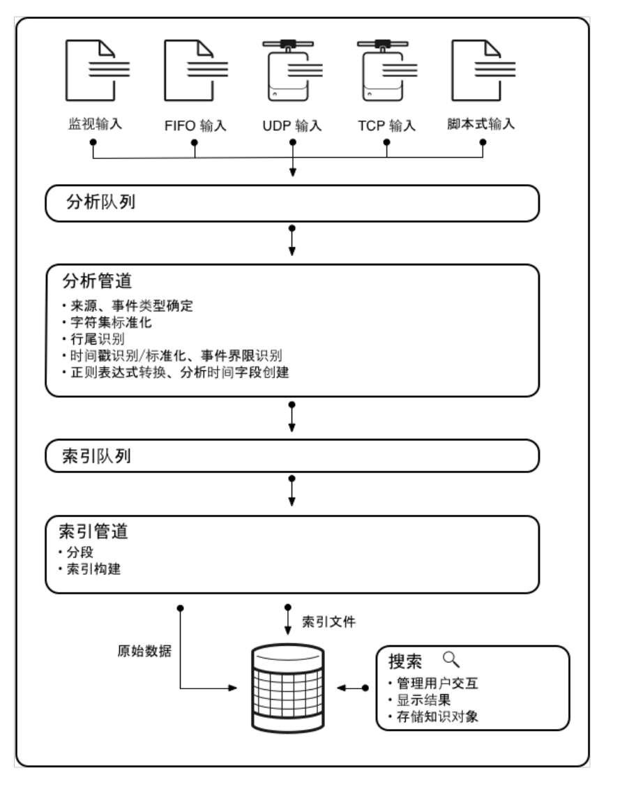

<!-- toc -->

- [管理员手册](#%E7%AE%A1%E7%90%86%E5%91%98%E6%89%8B%E5%86%8C)
  * [配置文件](#%E9%85%8D%E7%BD%AE%E6%96%87%E4%BB%B6)
    + [编辑配置文件](#%E7%BC%96%E8%BE%91%E9%85%8D%E7%BD%AE%E6%96%87%E4%BB%B6)
  * [数据管道](#%E6%95%B0%E6%8D%AE%E7%AE%A1%E9%81%93)
  * [开发应用](#%E5%BC%80%E5%8F%91%E5%BA%94%E7%94%A8)
    + [指导](#%E6%8C%87%E5%AF%BC)
  * [kv store](#kv-store)
    + [内置的 MongoDB](#%E5%86%85%E7%BD%AE%E7%9A%84-mongodb)
      - [安装目录](#%E5%AE%89%E8%A3%85%E7%9B%AE%E5%BD%95)
- [数据](#%E6%95%B0%E6%8D%AE)
  * [存储](#%E5%AD%98%E5%82%A8)
    + [索引](#%E7%B4%A2%E5%BC%95)
      - [索引示例](#%E7%B4%A2%E5%BC%95%E7%A4%BA%E4%BE%8B)
    + [数据分类](#%E6%95%B0%E6%8D%AE%E5%88%86%E7%B1%BB)
    + [存储位置](#%E5%AD%98%E5%82%A8%E4%BD%8D%E7%BD%AE)

<!-- tocstop -->

# 管理员手册

## 配置文件

### 编辑配置文件
⼤多数 Splunk 配置信息存储在 .conf ⽂件中。这些⽂件位于 Splunk 安装⽬录（在⽂档中通常称为 $SPLUNK_HOME）下的/etc/system 下。⼤多数情况下，可将这些⽂件复制到本地⽬录并使⽤⾸选的⽂件编辑器对其进⾏更改。

## 数据管道
数据在从原始输⼊转换为可搜索事件过程中经历了⼏个阶段。此过程称为数据管道，由以下四个阶段构成：
输⼊
分析
索引
搜索


## 开发应用
Splunk 不⽀持 Splunkbase 上的所有应⽤和加载项。
有关应⽤和加载项的⽀持选项列表，参阅 Splunk 开发⼈员⻔户中的“Splunkbase 上应⽤的⽀持类型”。
### 指导
dev.splunk.com

## kv store
主要存储元数据、配置、状态信息等，而不用来存储需要进行大规模搜索和分析的数据。kv store底层使用的是 MongoDB 来存储数据。

### 内置的 MongoDB
Splunk Enterprise 自带一个嵌入式的 MongoDB 实例，这个实例只用于 KV Store 的数据存储和操作。当安装 Splunk Enterprise 时，MongoDB 已经被包含在安装包中并自动配置好了。
在 Splunk Enterprise 的本地部署中，MongoDB 的数据文件通常存储在 $SPLUNK_HOME/var/lib/splunk/kvstore/mongo 目录下。
当启动 Splunk Enterprise 时，Splunk 会自动启动内置的 MongoDB 实例，并管理其配置和操作。用户不需要进行任何额外的设置或下载。

#### 安装目录
MongoDB 二进制文件： $SPLUNK_HOME/bin/splunkd
MongoDB 数据存储目录： $SPLUNK_HOME/var/lib/splunk/kvstore/mongo

# 数据
## 存储
存储在称为索引（Index）的结构中。这些索引实际上是存储在文件系统中的一组文件和目录，而没有使用传统的关系型数据库。

### 索引
数据存储在索引中，每个索引代表一个逻辑数据存储单元。
索引由一组事件数据和索引文件组成，索引文件用于加速数据检索。

#### 索引示例
假设有一个 Web 服务器的访问日志数据，你可以将这些日志数据导入 Splunk，并存储在一个名为 web_access 的索引中。
数据示例（Web 访问日志）：
```
127.0.0.1 - - [10/Oct/2023:13:55:36 -0700] "GET /index.html HTTP/1.1" 200 1024
192.168.1.1 - - [10/Oct/2023:13:56:01 -0700] "POST /login HTTP/1.1" 302 512
```
在 Splunk 中，数据会被分解成事件：
```
_event_1:
{
  "host": "127.0.0.1",
  "time": "10/Oct/2023:13:55:36 -0700",
  "method": "GET",
  "url": "/index.html",
  "status": 200,
  "bytes": 1024
}

_event_2:
{
  "host": "192.168.1.1",
  "time": "10/Oct/2023:13:56:01",
  "method": "POST",
  "url": "/login",
  "status": 302,
  "bytes": 512
}

```
查询示例：
```
index=web_access | stats count by status
```
该查询会搜索 web_access 索引中的所有事件，并按 HTTP 状态码统计事件的数量。


### 数据分类
热数据（Hot Data）：最近写入的数据，存储在内存中并实时可搜索。热数据存储在 hot 目录中。
温数据（Warm Data）：热数据冷却后转移到温数据，这些数据仍然可搜索。温数据存储在 warm 目录中。
冷数据（Cold Data）：较旧的数据，存储在冷存储中，但仍然可搜索。冷数据存储在 cold 目录中。
冻结数据（Frozen Data）：超过保留期的数据，默认情况下会被删除，可以配置为转移到外部存储。

### 存储位置
默认情况下，Splunk 的数据存储在 $SPLUNK_HOME/var/lib/splunk 目录下。在该目录下，每个索引都有一个单独的子目录。例如：
```
$SPLUNK_HOME/var/lib/splunk/
├── _internaldb
├── _audit
├── main
├── my_custom_index
└── ...
```
每个索引目录中包含热、温、冷数据的子目录。例如：
```
$SPLUNK_HOME/var/lib/splunk/main/
├── db
│   ├── hot_v1_0
│   ├── warm_v1_0
│   ├── ...
├── colddb
└── thaweddb

```

# 告警
## 告警配置
### 告警触发后操作
#### 日志事件
为可搜索的告警事件建⽴⽇志和索引。
##### 存储位置
在配置告警触发后操作中有"日志事件"的情况下，当告警被触发后，相关日志事件会被记录在 Splunk 内部日志中。具体来说，这些日志事件会被记录在 _internal 索引中，该索引存储了 Splunk 自身的操作日志和内部活动信息。
```
$SPLUNK_HOME/var/log/splunk/scheduler.log
```
但这个日志文件不仅包含告警信息，还包含调度器执行的搜索等信息。

如果要过滤出只有告警信息的日志行：
```
import re

def filter_alerts(input_file, output_file):
    # 定义告警事件的正则表达式模式
    # 使用正则表达式 savedsearch_name=".*" 来匹配包含告警事件的日志行。savedsearch_name 是告警事件日志行中常见的字段。
    alert_pattern = re.compile(r'savedsearch_name=".*"')

    with open(input_file, 'r') as infile, open(output_file, 'w') as outfile:
        for line in infile:
            # 检查行是否包含告警事件
            if alert_pattern.search(line):
                outfile.write(line)

if __name__ == "__main__":
    input_file = "/opt/splunk/var/log/splunk/scheduler.log"  # 请根据实际安装路径修改
    output_file = "alerts_only.log"
    filter_alerts(input_file, output_file)
    print(f"Filtered alert events written to {output_file}")


```


